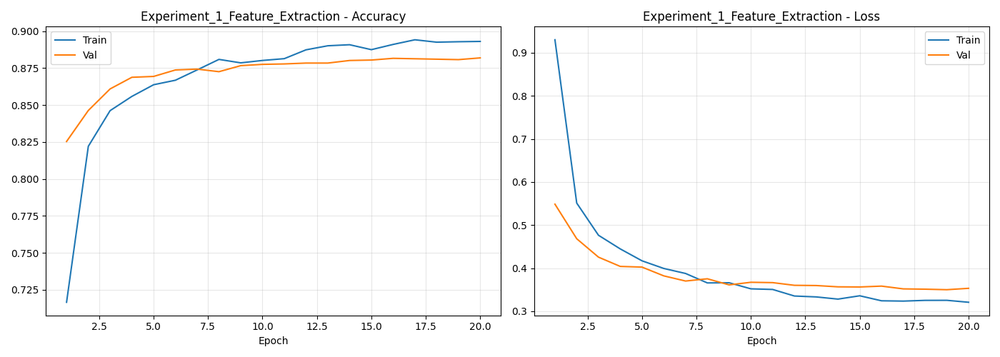
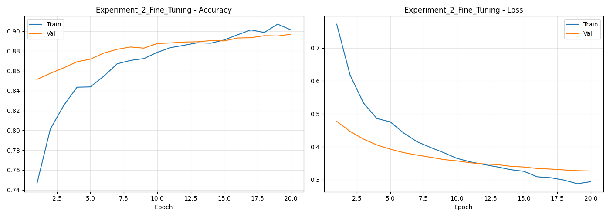
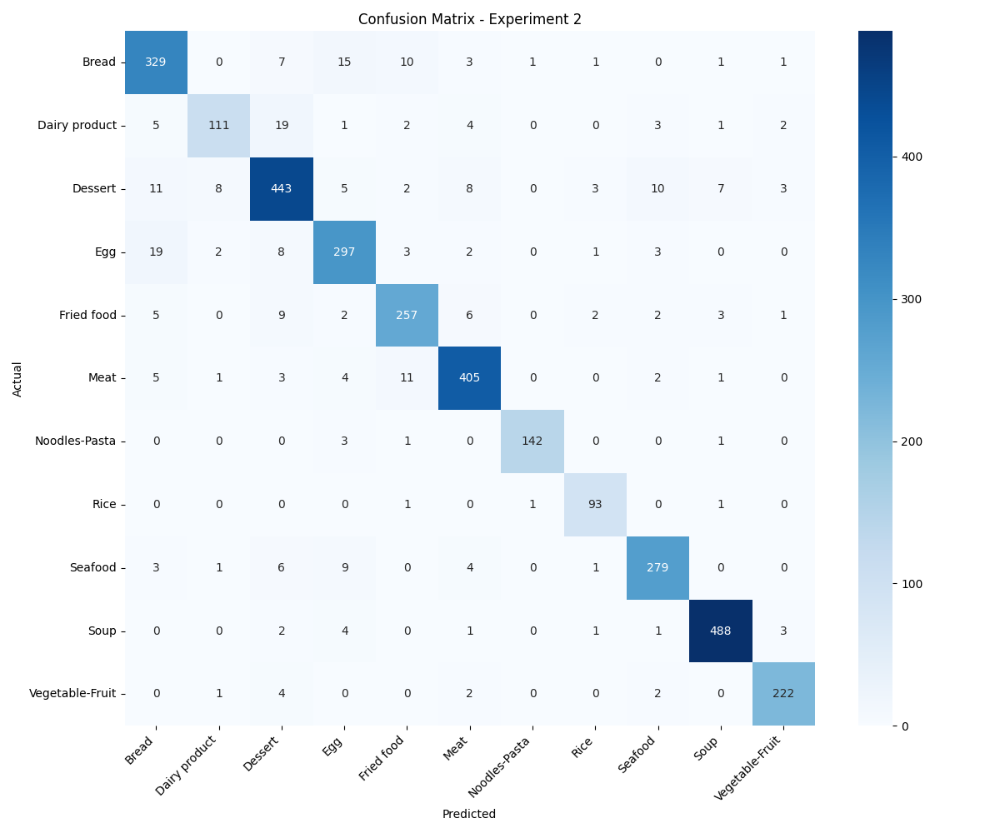

# Transfer Learning — Food11 Classification

Applying transfer learning using **EfficientNetB0** on the Food11 dataset with two approaches: Feature Extraction and Fine-Tuning. All experiments tracked with MLflow on DagsHub.

---

## Dataset
[Food11 Image Dataset — Kaggle](https://www.kaggle.com/datasets/trolukovich/food11-image-dataset)

| Split | Images |
|---|---|
| Train | 9,866 |
| Validation | 3,430 |
| Test | 3,347 |

**Classes (11):** Bread, Dairy product, Dessert, Egg, Fried food, Meat, Noodles-Pasta, Rice, Seafood, Soup, Vegetable-Fruit

> Dataset is imbalanced — Rice has the fewest samples (280 train) while Dessert and Soup have the most (1,500 train each).

---

## Model Architecture

| Layer | Details |
|---|---|
| Base | EfficientNetB0 (ImageNet pretrained) |
| Pooling | GlobalAveragePooling2D |
| Regularization | Dropout(0.3) |
| Output | Dense(11, softmax) |

- **Loss:** Sparse Categorical Crossentropy
- **Optimizer:** Adam
- **Preprocessing:** EfficientNet `preprocess_input`
- **Augmentation:** RandomFlip, RandomRotation, RandomZoom (train only)

---

## Experiment Summary

| Experiment | Approach | LR | Val Accuracy | Test Accuracy |
|---|---|---|---|---|
| Exp 1 | Feature Extraction (head only) | 1e-3 | 88.08% | 90.44% |
| Exp 2 | Fine-Tuning (last 20 layers) | 1e-5 | 89.68% | 91.60% |

---

## Plots

### Experiment 1 — Feature Extraction

### Experiment 2 — Fine-Tuning

---

## Observations

### Feature Extraction vs Fine-Tuning
Fine-tuning outperformed feature extraction by **~1.6%** on val accuracy and **~1.2%** on test accuracy.
Unfreezing the last 20 layers allowed the model to better adapt pretrained features to the Food11 domain.

### Generalization
Both models generalized well — test accuracy exceeded val accuracy in both experiments,
confirming clean data splits with no leakage between train, val, and test sets.

### Convergence
Feature extraction converged steadily across 20 epochs with only the classification head trained.
Fine-tuning required more epochs to stabilize — accuracy dropped to 74% at epoch 1 due to newly unfrozen layers adapting, then improved consistently throughout training.

### Overfitting
No significant overfitting observed in either experiment.
Train and val curves remained within 1-2% of each other throughout,
supported by **Dropout(0.3)** and **ReduceLROnPlateau** callbacks.

### Weakest Class
Dairy product showed the lowest recall (0.75) in both experiments,
likely due to having the fewest training samples (429 train, 148 test).

---

## MLflow Tracking
All runs tracked on DagsHub with parameters, metrics, and artifacts:

[📊 View Experiments on DagsHub](https://dagshub.com/Shamah1/food11-transfer-learning.mlflow/#/experiments/0)
